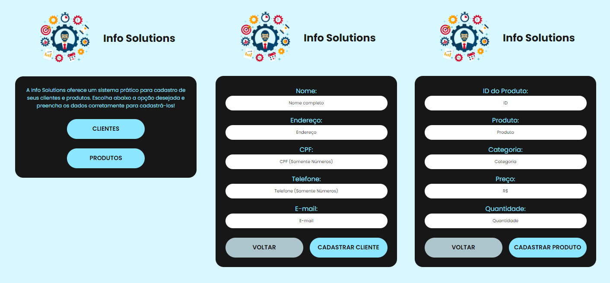

# Hiring Coders # 2 - Challenge 2 (Registering Page)

### About:

Page for registering customers and products of a company. It was developed for the second challenge of Hiring Coders #2 by Gama Academy.

### Preview:

### Technologies used in this project:

- React

### Credits:

<a href="https://www.freepik.com"><a href='https://www.freepik.com/vectors/design'>Design vector created by freepik - www.freepik.com</a></a>
